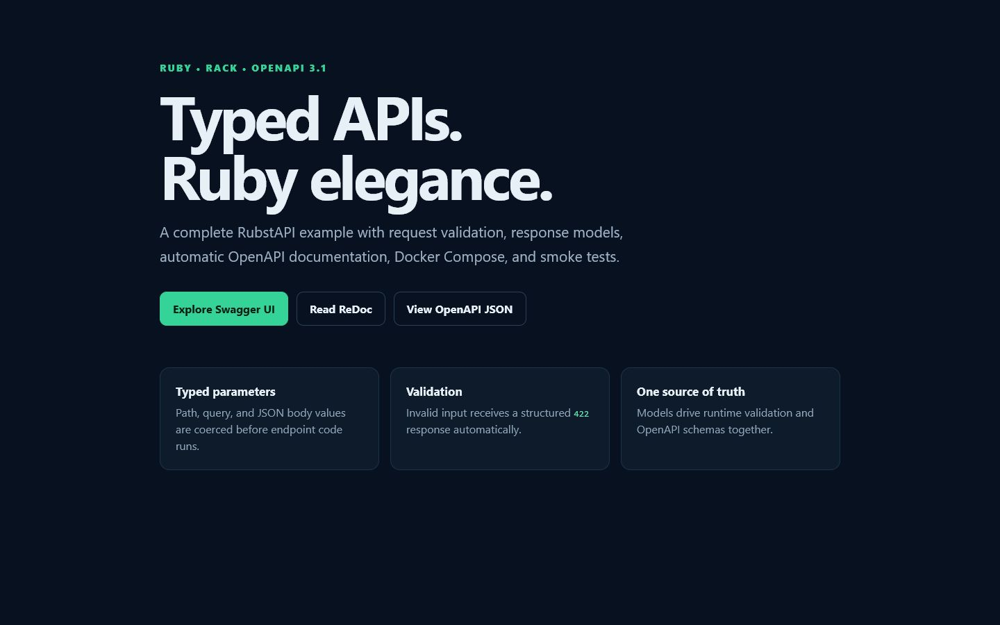
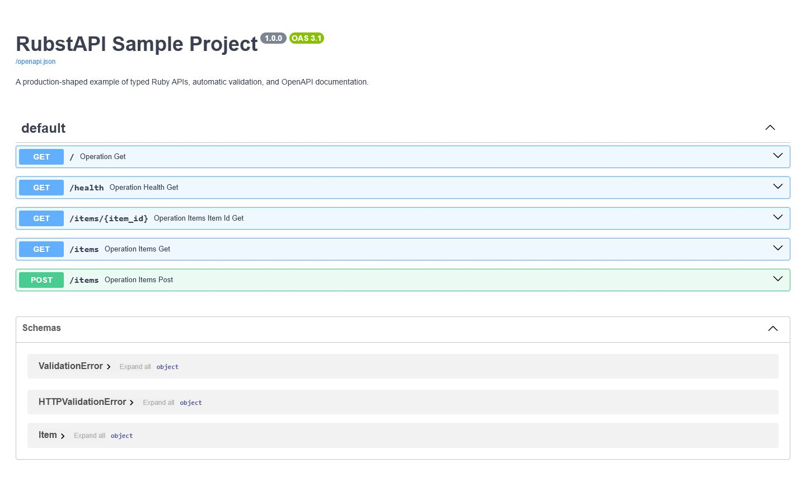
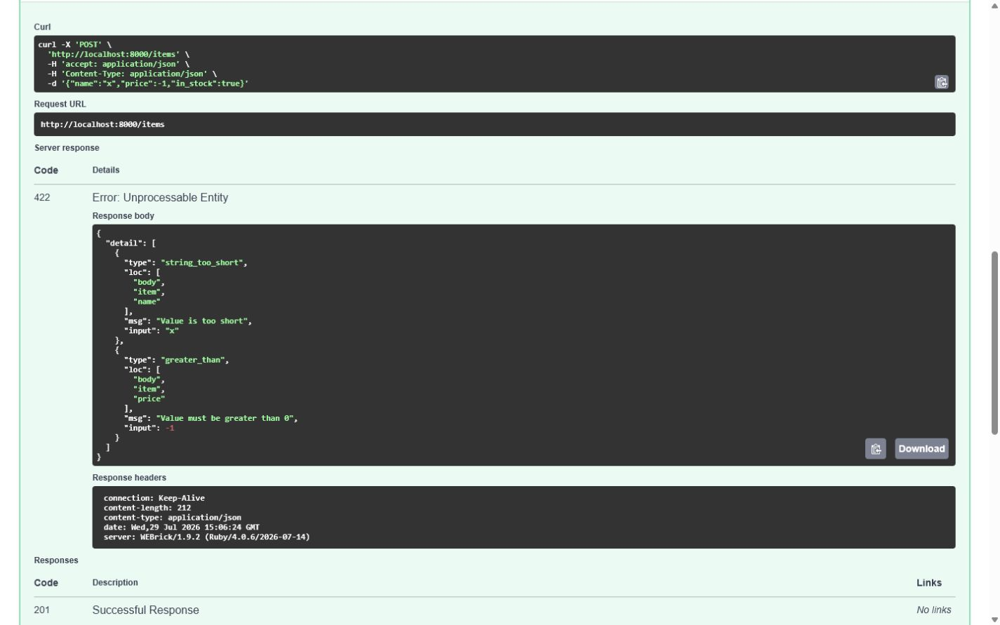

# RubstAPI Sample Project

[](https://www.ruby-lang.org/)
[](https://rubygems.org/gems/rubst_api)
[](https://spec.openapis.org/oas/v3.1.0)
[](https://docs.docker.com/compose/)
[](LICENSE)

A production-shaped example repository for
[RubstAPI](https://github.com/joryleech/RubstApi), the FastAPI-inspired,
Rack-compatible framework for typed Ruby REST APIs.

This sample demonstrates how a small amount of Ruby can provide request
coercion, model validation, structured errors, response schemas, OpenAPI 3.1,
Swagger UI, ReDoc, health checks, Docker Compose, and end-to-end smoke tests.



## What this repository demonstrates

- Typed path and query parameters
- JSON request models with constraints and defaults
- Response-model serialization
- Automatic `422 Unprocessable Entity` responses
- Application-level `404` errors
- Generated OpenAPI 3.1 schemas
- Interactive Swagger UI and ReDoc
- RubyGems installation through Bundler
- Reproducible Docker Compose setup
- Live HTTP smoke testing
- Container health checks

## Screenshots

### Interactive API documentation

RubstAPI generates Swagger UI directly from the same route and model
declarations used at runtime.



### Structured validation

Invalid request bodies are rejected before endpoint logic runs and return
machine-readable error locations and messages.



## Quick start

### Docker Compose

The only prerequisite is Docker Desktop or another Docker Compose installation.

```console
git clone <your-sample-repository-url>
cd RubstApi-Sample-Project
docker compose up --build
```

Open:

| Resource | URL |
| --- | --- |
| Landing page | <http://localhost:8000/> |
| Swagger UI | <http://localhost:8000/docs> |
| ReDoc | <http://localhost:8000/redoc> |
| OpenAPI document | <http://localhost:8000/openapi.json> |
| Health check | <http://localhost:8000/health> |

Stop the service:

```console
docker compose down
```

### Local Ruby

Ruby 3.2 or newer is required.

```console
bundle install
bundle exec rubst_api run app.rb --host 0.0.0.0 --port 8000
```

RubstAPI is resolved from [RubyGems.org](https://rubygems.org/gems/rubst_api)
through the standard `Gemfile` and `Gemfile.lock`. This repository does not
vendor a `.gem` package.

The sample also declares `base64` explicitly because Ruby 4 distributes it as a
separate gem while RubstAPI `0.1.0` uses it for HTTP authentication helpers.
Future RubstAPI releases declare this dependency directly.

## Try the API

List the example catalog:

```console
curl http://localhost:8000/items
```

Exercise typed path and query parameters:

```console
curl "http://localhost:8000/items/1?q=keyboard"
```

Create a valid item:

```console
curl -X POST http://localhost:8000/items \
  -H "Content-Type: application/json" \
  -d '{"name":"Ruby Book","price":39.95}'
```

Trigger automatic validation:

```console
curl -X POST http://localhost:8000/items \
  -H "Content-Type: application/json" \
  -d '{"name":"x","price":-1}'
```

## Run the smoke suite

Start the service, then run:

```console
ruby smoke_test.rb
```

The suite makes real HTTP requests and verifies:

1. the HTML landing page;
2. list and detail endpoints;
3. path-parameter coercion;
4. application-level `404` responses;
5. successful model creation;
6. automatic `422` validation;
7. OpenAPI generation;
8. Swagger UI availability.

## Implementation notes

### Application boundary

`APP` is a Rack-compatible callable and the single application entry point:

```ruby
APP = RubstApi::App.new(
  title: "RubstAPI Sample Project",
  description: "A production-shaped typed Ruby API example.",
  version: "1.0.0"
)
```

The `rubst_api` executable loads `app.rb`, discovers `APP`, and serves it using
Rackup and WEBrick.

### Model-driven validation

`Item` is both the runtime validator and the source for JSON Schema:

```ruby
class Item < RubstApi::Model
  field :name, String, min_length: 2
  field :price, Float, gt: 0
  field :in_stock, :boolean, default: true
end
```

The endpoint only receives a validated `Item`:

```ruby
APP.post("/items", params: {
  item: RubstApi.Body(Item)
}, response_model: Item, status_code: 201) do |item:|
  item
end
```

No controller-level parsing or validation branches are required.

### Typed request parameters

Path and query inputs declare their source, type, and constraints:

```ruby
APP.get("/items/{item_id}", params: {
  item_id: RubstApi.Path(Integer, ge: 1),
  q: RubstApi.Query(String, required: false, max_length: 50)
}) do |item_id:, q:|
  # item_id is an Integer; q is a String or nil.
end
```

### OpenAPI as an output

RubstAPI builds the OpenAPI document from registered routes and models. Swagger
UI and ReDoc consume `/openapi.json`, so runtime behavior and documentation
share one source of truth.

### Docker dependency flow

The image copies `Gemfile` and `Gemfile.lock` before application code:

```dockerfile
COPY Gemfile Gemfile.lock ./
RUN bundle install
```

That layer is cached until dependencies change. Application edits therefore do
not reinstall gems on every build.

The locked dependency graph is resolved entirely from RubyGems.org; no local
path dependency or vendored RubstAPI package is used.

### Production considerations

This repository intentionally stays small. A production service would typically
add:

- a production Rack server and worker strategy;
- persistent storage instead of in-memory constants;
- structured logging, tracing, and metrics;
- authentication and authorization dependencies;
- rate limiting and request-size limits;
- secrets management;
- durable background jobs;
- CI across supported Ruby versions;
- deployment-specific readiness and shutdown behavior.

## Repository layout

```text
.
├── app.rb              # Models, routes, and landing page
├── compose.yaml        # Service, port, and health-check configuration
├── Dockerfile          # Reproducible Ruby image
├── Gemfile             # RubyGems dependencies
├── Gemfile.lock        # Locked dependency graph
├── smoke_test.rb       # Live HTTP verification
└── docs/images/        # README screenshots
```

## Troubleshooting

### Port 8000 is already in use

Change the published port in `compose.yaml`, for example:

```yaml
ports:
  - "8080:8000"
```

Then use <http://localhost:8080>.

### Rebuild dependencies

```console
docker compose build --no-cache
docker compose up
```

### Inspect the service

```console
docker compose ps
docker compose logs --tail 100 api
```

## Related projects

- [RubstAPI](https://github.com/joryleech/RubstApi)
- [RubstAPI on RubyGems](https://rubygems.org/gems/rubst_api)
- [Python FastAPI](https://fastapi.tiangolo.com/)
- [Rack](https://rack.github.io/)
- [OpenAPI Specification](https://spec.openapis.org/oas/v3.1.0)

RubstAPI is an independent Ruby project inspired by Python FastAPI. It is not
affiliated with or endorsed by the FastAPI project.

## License

This sample project is available under the [MIT License](LICENSE).
